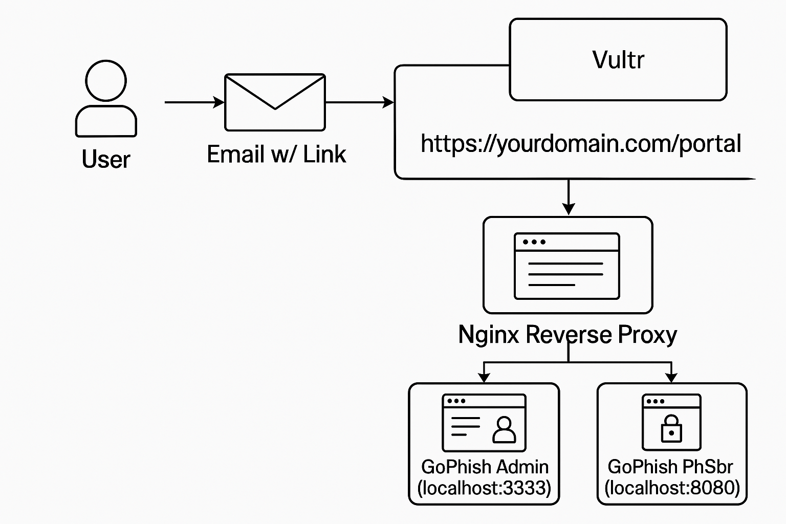

# Phishing Simulation Playbook

This repository documents a real-world, **authorized phishing awareness 
campaign** using [GoPhish](https://getgophish.com/), hosted on a hardened 
VPS with a custom domain (`yourdomain.com`). It is structured as a red 
team playbook for demonstrating phishing tactics, infrastructure setup, 
campaign execution, and reporting.

> ** ⚠️ Ethical Notice**: This campaign is fully authorized and conducted 
under strict ethical guidelines. It is intended purely for educational and 
security testing purposes.

---

## Playbook Contents

- [Overview](#-overview)
- [Project Goals](#-project-goals)
- [Technologies Used](#-technologies-used)
- [Project Structure](#-project-structure)
- [Setup & Configuration](#️-setup--configuration)
- [Campaign Execution](#-campaign-execution)
- [Reports](#-reports)
- [Assets](#-assets)
- [License](#-license)

---

## Overview

This project simulates a **controlled phishing campaign** to test an 
organization's email filtering effectiveness and user security awareness. 
All components, including domain infrastructure, reverse proxy, and 
GoPhish setup, are managed by the operator.

---

## Project Goals

- Test email server filtering for suspicious links and spoofed senders.
- Evaluate end-user awareness across different departments.
- Provide actionable reporting and recommendations based on results.
- Build a reusable red team playbook for future phishing simulations.

---

## Technologies Used

- **GoPhish** – Phishing simulation framework
- **Vultr VPS** – Hosting and deployment
- **Nginx** – Reverse proxy and SSL termination
- **Let's Encrypt** – TLS certificates via Certbot
- **Namecheap** – DNS and email services
- **Ubuntu Server 22.04** – Secure base OS
- **GitHub** – Version control and public playbook hosting

---

## Project Structure

### Network Architecture

---

## Setup & Configuration

See the [`configs/`](https://github.com/cylosec/phishing-campaign/tree/main/configs) folder for actual 
files and examples.  
For a full walkthrough of provisioning a VPS, securing it, and installing GoPhish, see the [Vultr Setup 
Guide](https://github.com/cylosec/phishing-campaign/blob/main/VULTR_SETUP_GUIDE.md).

- GoPhish installed and configured on a Vultr VPS at `yourdomain.com`
- Nginx reverse proxy forwards:
  - `https://yourdomain.com/admin` → GoPhish admin UI
  - `https://yourdomain.com/portal` → phishing landing page
- TLS enabled using Certbot and Let's Encrypt
- Server hardened with UFW, Fail2Ban, and security updates

> [!WARNING]  
> In production, GoPhish runs on `localhost (127.0.0.1)` and is exposed externally only via Nginx for 
security.

---

## Campaign Execution

> See the [`campaigns/`](./campaigns) folder for templates and assets.

- **Target**: A predefined set of internal users
- **Email Template**: A spoofed internal support message with a link to a 
harmless awareness test page
- **Landing Page**: Customized spoof page that says, “You’ve been spoofed”
- **Tracking**: Click tracking only (no credential harvesting)
- **Sender Domain**: `yourdomain.com` (authorized and configured via 
Namecheap DNS)

---

## Reports

> 📁 See the [`reports/`](./reports) folder for full engagement summaries.

- Metrics include open rate, click rate, device info
- Timeline of actions taken
- Lessons learned and remediation suggestions

---

## Assets

> 📁 See the [`assets/`](./assets) folder for screenshots, phishing page 
previews, and architecture diagrams.

---

## License

This repository is intended solely for ethical cybersecurity testing, 
educational purposes, and professional portfolio demonstration. Do **not** 
use this playbook to perform unauthorized or malicious phishing attacks.

