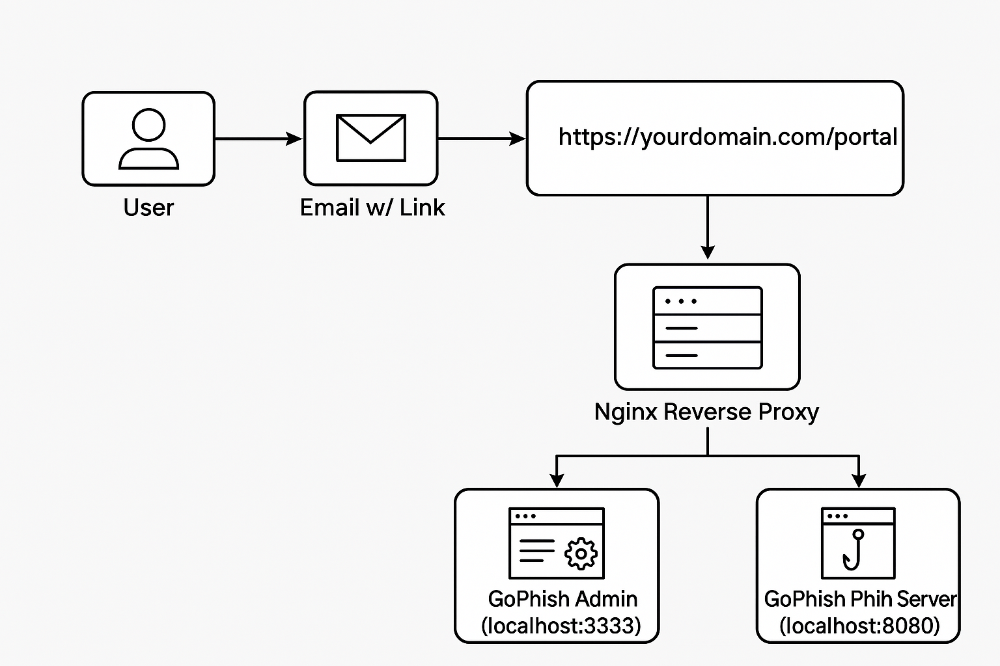

# Phishing Simulation Engagement Summary

**Client:** [Redacted Organization]  
**Operator:** Cyrus Lomibao  
**Date:** [Insert Engagement Date]  
**Status:** Completed  
**Playbook:** [`phishing-simulation-playbook`](../README.md)

---

## Objective

Simulate a real-world phishing campaign to evaluate:

- Email server filtering capabilities
- End-user security awareness
- Potential for credential theft or link-click exploitation

---

## Tools & Infrastructure

| Component        | Details                                |
|------------------|----------------------------------------|
| Framework        | GoPhish                                |
| VPS Provider     | Vultr (Ubuntu 22.04 LTS)               |
| Reverse Proxy    | Nginx (TLS via Let's Encrypt)          |
| Domain           | `yourdomain.com` (DNS via Namecheap)  |
| Email            | Private Mailbox (SPF, DKIM, DMARC configured) |
| Campaign Hosting | `https://yourdomain.com/portal`        |

## Engagement Diagram

---

## ✉️ Campaign Summary

| Detail           | Info                                        |
|------------------|---------------------------------------------|
| Target Audience  | Internal staff at [sbcc.community]          |
| Phishing Email   | Spoofed IT support alert with a "Review Activity" 
link |
| Landing Page     | Custom awareness page: “You’ve been spoofed!” |
| Data Collected   | Link clicks only (no credentials harvested) |
| Authorization    | Fully approved test engagement            |

---

## Results

| Metric           | Result              |
|------------------|---------------------|
| Emails Delivered | X (e.g., 25)        |
| Open Rate        | X% (e.g., 76%)      |
| Click Rate       | X% (e.g., 48%)      |
| Repeat Clickers  | X (e.g., 3)         |
| False Positives  | None / Low / High   |

> 📈 [Include screenshots or paste key metrics from GoPhish report export]

---

## Observations & Lessons

- SPF/DKIM/DMARC were bypassed successfully due to aliasing
- ⚠Some users clicked immediately with no link hovering or scrutiny
- No internal alert was triggered (could improve detection stack)

---

## Recommendations

- Train users to hover over links and verify senders
- Configure advanced link scanning or sandboxing
- Add mailbox rules to flag similar spoofed emails
- Expand SOC monitoring to include phishing indicators

---

## Notes

- This was a **harmless** engagement with no credential theft
- Email link resolved to an internal awareness page, not a live exploit
- Results have been anonymized for public documentation

---

> Want the full toolkit? See [`configs/`](../configs) and 
[`campaigns/`](../campaigns)

